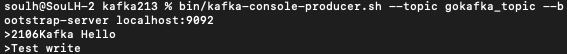

# Go-Apache-Kafka 

### Starting (M1-ARM64)

```
[Kafka Download](https://www.apache.org/dyn/closer.cgi?path=/kafka/3.2.0/kafka_2.13-3.2.0.tgz)

```
```
Start ZooKeeper Service

bin/zookeeper-server-start.sh config/zookeeper.properties

```

```
Start Kafka

bin/kafka-server-start.sh config/server.properties

```


```
Create Topic

bin/kafka-topics.sh --create --topic quickstart-events --bootstrap-server localhost:9092

```


```
Write 

bin/kafka-console-producer.sh --topic quickstart-events --bootstrap-server localhost:9092
```


<p>
    

</p>

```
Read

go run usermgmt_server/usermgmt_server.go
```

## Server Snapshot

<p>
    

</p>


#### Thank You 